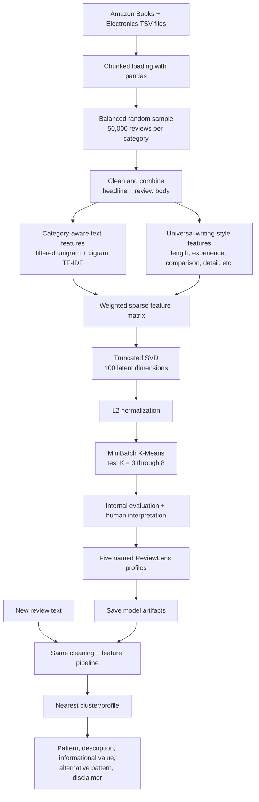

# ReviewLens

**Discover *how* a product review is written, without needing a "useful / not useful" label.**

ReviewLens is an unsupervised NLP prototype. It learns recurring review-writing patterns from 100,000 Amazon reviews (Books and Electronics) and assigns any new review to its closest pattern. A small web dashboard lets you paste reviews and compare pattern mixes across products.

> **Important:** ReviewLens returns the closest learned pattern. It does not claim a review is objectively useful, truthful, or high quality, and it does not return a calibrated probability.

## The five patterns

| Pattern | What it looks like | Informational value |
| --- | --- | --- |
| Balanced Evaluative Review | Weighs positive and negative points | Moderate to high |
| Extended Analytical Review | Long, multi-sentence explanation or analysis | High |
| Concise General Opinion | Brief praise, criticism, or rating-led opinion | Low to moderate |
| Long-Term Usage Experience | Evidence from real use over time, specific performance details | High |
| Personal Experience and Recommendation | First-person experience and recommendation language | Moderate |

## Quick start

You need Python 3 and Node.js. The trained model artifacts are included in `models/`, so no training or raw data is needed to run the app.

```bash
# 1. Backend (from the repo root)
pip install -r requirements.txt
python3 -m src.server            # http://127.0.0.1:8001

# 2. Dashboard (in a second terminal)
cd frontend
npm install
npm run dev                      # http://localhost:5173 (proxies /analyze to :8001)
```

Run the backend from the repo root: the inference module loads `models/` relative to the working directory.

### Use the model from Python

```python
from src.reviewlens_inference import ReviewLens

reviewlens = ReviewLens("models")
print(reviewlens.analyze(
    "I have used these headphones for six months. The battery lasts eight hours, "
    "but the earcups become uncomfortable after long use."
))
```

### Use the API

```bash
curl -s -X POST http://127.0.0.1:8001/analyze \
  -H "Content-Type: application/json" \
  -d '{"text": "Great sound and comfy. Five stars."}'
```

The response contains `review_pattern`, `description`, `informational_value`, `alternative_pattern`, `closest_cluster`, `distance_to_closest_cluster`, and a `note` disclaimer. Empty text or invalid JSON returns `400 {"error": "..."}`. The raw distance is an internal diagnostic: do not present it as an accuracy or confidence score.

## The dashboard

- KPI cards: reviews analysed, top pattern, share of high-informational-value reviews, top alternative pattern
- Pattern mix per product (stacked bars) and informational-value distribution
- Review table with expandable rows (full text, description, disclaimer) and product filter chips
- "Analyze your own review" box
- 35 preset reviews across 5 sample products (headphones, laptop, smartphone, novel, cookbook) for quick demos

Built with React 18 and Vite 5. The frontend only talks to `POST /analyze`; it never loads raw data or triggers training.

## Project objective

Product-review datasets rarely contain a trustworthy label for "review usefulness". Helpful-vote counts are incomplete and depend on product popularity, review age, and visibility. ReviewLens therefore treats the task as **unsupervised pattern discovery**:

> Can NLP discover meaningful review-writing patterns without training on a hand-made usefulness label?

Human interpretation is applied only after clustering, when representative reviews and feature signals are inspected.

## How it works



### Data

Training used Amazon customer-review TSV files from two categories, about 3.1 million source reviews each. The model was trained on a balanced **100,000-review** sample (50,000 per category). Files are scanned in chunks, so the full datasets are never loaded into memory. Raw TSV data is training material only and is excluded from this repository.

### Training pipeline

1. **Cleaning:** join headline and body, decode HTML entities, strip tags and URLs, normalise whitespace, lowercase, drop texts under 15 characters. Negations (`not`, `no`, `never`) are deliberately kept because removing them can flip meaning ("not good" becoming "good").
2. **Category-aware text features:** plain TF-IDF over a combined dataset grouped reviews by topic words ("author", "story", "battery", "sound"). To reduce that, ReviewLens builds a unigram and bigram vocabulary, computes document frequency per category, and removes terms that appear in at least 0.2% of one category and at least five times more often there than in the other. 4,052 category-specific terms were removed; 75,948 text features remain.
3. **Universal writing-style features:** nine category-independent features: log word count, sentence count, vocabulary diversity, numeric-detail rate, first-person rate, long-term-use language rate, comparison rate, contrast / pros-and-cons rate, exclamation count. They are standardised, L2-normalised, and weighted by `0.8` before joining the TF-IDF matrix.
4. **Dimensionality reduction:** Truncated SVD to 100 components (7 iterations, seed 42), retaining 50.3% explained variance, followed by L2 normalisation.
5. **Clustering:** MiniBatchKMeans (`batch_size=2048`, `n_init=10`, `max_iter=200`). K = 3 to 8 were compared using silhouette score, Davies-Bouldin index, cluster-size balance, and representative-review inspection. **K = 5** was selected.

Training lives in [notebooks/ReviewLens_Training.ipynb](notebooks/ReviewLens_Training.ipynb) (Google Colab, needs the raw TSV files).

### Inference

After training, the raw data is no longer needed. Every submitted review follows the same pipeline:

```text
Review text -> cleaning -> filtered TF-IDF + writing-style features
            -> SVD + normalisation -> distance to five cluster centres
            -> closest named profile
```

One review is processed instead of millions of rows, so the UI stays responsive.

## Evaluation

### Internal clustering metrics

| Metric | Prototype result | Interpretation |
| --- | ---: | --- |
| Selected clusters | 5 | Best balance of metric quality and interpretability |
| Silhouette score | 0.1785 | Positive separation in a noisy, high-variation text dataset |
| Davies-Bouldin index | 1.9654 | Reasonable between-cluster distinction; lower is better |
| Cluster-size range | about 14%-30% | No tiny or overwhelmingly dominant cluster |
| SVD explained variance | 50.3% | Useful structure retained after compression |

### Secondary helpful-vote check

Helpful votes are **not** a model target, feature, or label; they are only examined after clustering. The results supported the human interpretations: the Extended Analytical cluster had the longest reviews and the strongest average helpfulness ratios in both categories, while Concise General Opinion had shorter reviews and lower ratios. This is correlation, not proof of objective usefulness.

### Why there is no accuracy, precision, recall, or F1

Those metrics need known correct labels. This dataset has no reliable ground-truth "usefulness" class, and the project deliberately avoids creating a false label from helpful votes. A future evaluation can use a separately collected, manually annotated holdout set.

## Repository structure

```text
ReviewLens/
├── frontend/                     # React + Vite dashboard
│   └── src/                      #   App.jsx, presets.js, styles.css
├── models/                       # Trained artifacts (about 11 MB) and profile JSON
├── notebooks/
│   └── ReviewLens_Training.ipynb # Colab training notebook
├── src/
│   ├── reviewlens_inference.py   # ReviewLens class: the integration boundary
│   └── server.py                 # stdlib HTTP server: POST /analyze
└── requirements.txt
```

## Model artifacts

`models/` contains `tfidf_vectorizer`, `svd_model`, `normalizer`, `clustering_model`, and `style_scaler` (`.joblib`), plus `cluster_profiles.json` and `model_metadata.json`. See [models/README.md](models/README.md).

`scikit-learn` is pinned to **1.6.1**, the version used to train and save the artifacts, to avoid incompatibility warnings when loading them. Keep each artifact under GitHub's 100 MB file limit.

## Limitations and future work

- Trained on Books and Electronics only; more categories need balanced chunked sampling and full retraining.
- Some clusters still show category skew. The model reduces topic dominance but does not claim to be perfectly category-neutral.
- The five profile names are human interpretations of unsupervised clusters.
- No supervised accuracy is claimed without an independently labelled evaluation set.
- The backend is a single-process stdlib server with no authentication or CORS, intended for local use.
- **Planned:** a sentiment layer trained from star ratings, with sentiment analysed by writing pattern; a comparison of logistic regression, BiLSTM, and a small transformer; more categories; CSV upload in the dashboard.

## Technology stack

- **NLP / ML:** Python, pandas, NumPy, SciPy, scikit-learn (`TfidfVectorizer`, `TruncatedSVD`, `MiniBatchKMeans`, `StandardScaler`, `Normalizer`), joblib
- **Training:** Google Colab and Google Drive
- **Backend:** Python standard-library HTTP server
- **Frontend:** React 18, Vite 5

No deep-learning model is used. The classical NLP approach is computationally practical, explainable, and fast at inference time.
