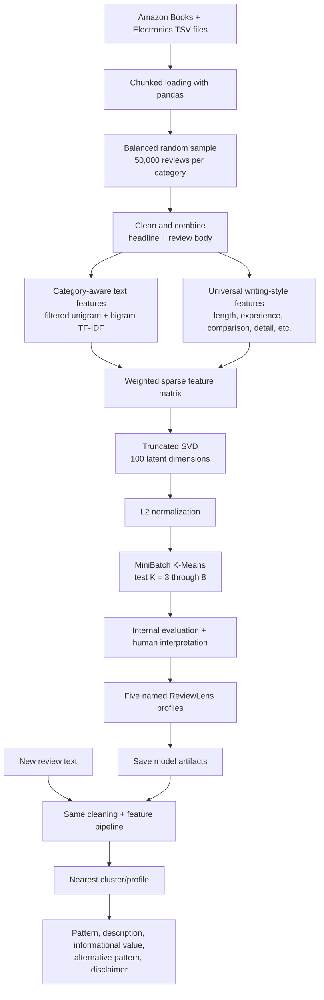

# ReviewLens

**Discover *how* a product review is written, without needing a "useful / not useful" label.**

ReviewLens is an unsupervised NLP prototype. It learns recurring review-writing patterns from 100,000 Amazon reviews (Books and Electronics) and assigns any new review to its closest pattern. A small web dashboard lets you paste reviews and compare pattern mixes across products.

> **Important:** ReviewLens returns the closest learned pattern. It does not claim a review is objectively useful, truthful, or high quality, and it does not return a calibrated probability.

## The five patterns

| Pattern | What it looks like | Informational value |
| --- | --- | --- |
| Balanced Evaluative Review | Weighs positive and negative points | Moderate to high |
| Extended Analytical Review | Long, multi-sentence explanation or analysis | High |
| Concise General Opinion | Brief praise, criticism, or rating-led opinion | Low to moderate |
| Long-Term Usage Experience | Evidence from real use over time, specific performance details | High |
| Personal Experience and Recommendation | First-person experience and recommendation language | Moderate |

## What the app does

ReviewLens has two layers:

1. **Pattern model (core, unchanged):** assigns any review to one of five learned writing patterns (below).
2. **Review analysis suite (added):** loads a review file, runs a batch pipeline, and shows what customers complain about, where opinions conflict, which reviews carry warning signals, and a few evidence-backed insights.

Everything in layer 2 is measured on the local sample and labelled **preliminary**. See Evaluation and the model card.

## Quick start

You need Python 3.11 and Node.js. The trained pattern model is in `models/`, so the app runs without raw data. The analysis suite needs a local review file (see Data below).

```bash
# 1. Backend (from the repo root)
pip install -r requirements.txt
python3 -m src.server            # http://127.0.0.1:8001

# 2. Dashboard (second terminal)
cd frontend
npm install
npm run dev                      # http://localhost:5173 (proxies /analyze, /app, /complaints, ... to :8001)
```

Run the backend from the repo root: the inference module loads `models/` relative to the working directory.

To see the analysis suite, open the dashboard, click **Load demo dataset**, then **Run analysis** (about 1-2 minutes). The first run downloads two small models (sentence embeddings and an NLI model) from Hugging Face.

### Use the model from Python

```python
from src.reviewlens_inference import ReviewLens

reviewlens = ReviewLens("models")
print(reviewlens.analyze(
    "I have used these headphones for six months. The battery lasts eight hours, "
    "but the earcups become uncomfortable after long use."
))
```

### Use the API

```bash
curl -s -X POST http://127.0.0.1:8001/analyze \
  -H "Content-Type: application/json" \
  -d '{"text": "Great sound and comfy. Five stars."}'
```

The response contains `review_pattern`, `description`, `informational_value`, `alternative_pattern`, `closest_cluster`, `distance_to_closest_cluster`, and a `note` disclaimer. Empty text or invalid JSON returns `400 {"error": "..."}`. The raw distance is an internal diagnostic: do not present it as an accuracy or confidence score.

## The dashboard

- **Overview:** metric tiles, key discoveries, complaint clusters, contradiction examples, suspicious-review counts. Filters for product, rating, and date range update the tiles.
- **Complaints:** cluster list with top terms, review counts, sentiment mix, and the original reviews per cluster.
- **Contradictions:** side-by-side opposing sentences on the same product and aspect, with a three-part explanation (evidence, possible interpretation, missing context).
- **Suspicious Reviews:** heuristic warning signals (duplicates, similar text, promotional wording, reviewer activity, bursts). Dismiss a flag without deleting it.
- **Insights:** short evidence-backed findings with numerators and denominators.
- **Analyze:** paste your own review and get its pattern, shown directly under the input. Also the original 35 preset reviews across five sample products.
- **Upload:** CSV, TSV, TXT, or XLSX. Uploaded files are cleaned and browsed; the analysis suite runs on the demo sample only.

Built with React 18 and Vite 5. The frontend only calls the local API; it never reads raw files directly.

## Analysis modules

| Module | Folder | What it does | Type |
| --- | --- | --- | --- |
| Batch loading and cleaning | `batch/` | Chunked reading, schema mapping, counted drops (empty text, bad ratings, bad dates, duplicate IDs) | Deterministic |
| N-gram experiment | `experiments/` | TF-IDF unigram / bigram logistic regression on a vote-derived usefulness label, compared with a majority baseline | Supervised (weak label) |
| Complaint discovery | `complaints/` | Groups reviews rated 1-3 stars by meaning (sentence embeddings, HDBSCAN or KMeans fallback) and labels groups with top terms | Unsupervised, preliminary |
| Contradiction investigator | `contradictions/` | Finds opposing sentences on the same product and aspect; verifies with an NLI model; keeps strong, same-keyword pairs | Heuristic + NLI model |
| Suspicious review investigator | `suspicion/` | Duplicate, similarity, promotional-wording, reviewer-activity, and burst signals. Warnings only | Heuristic, not validated |
| Insight engine | `insights/` | Turns the outputs above into 4-5 cards with real numbers and excerpts; hides low-evidence types | Rule-based |
| Dashboard API | `dashboard/` | Run-analysis job, demo loading, uploads, filters, overview data | Glue |
| Evaluation | `evaluation/` | Dataset report, n-gram report, quality checks, model card | Measurement |

Every analysis output is labelled preliminary. Nothing here is a validated fake-review classifier, and no complaint cluster has been evaluated against ground truth.

### Run the analysis from the command line

```bash
# needs the TSV in data/ (see Data)
python -m complaints.run          # writes reports/complaint_*
python -m contradictions.run      # writes reports/contradictions.*
python -m suspicion.run           # writes reports/suspicion_*
python -m insights.run            # writes reports/insights.json
python -m evaluation.quality_checks
python -m evaluation.model_card   # writes MODEL_CARD_RESULTS.md and model_card_metrics.json
```

Reports go to `reports/`. The model card (`MODEL_CARD_RESULTS.md`) and its metrics file (`model_card_metrics.json`) are at the repo root.

## Data

- The pattern model was trained on the Amazon US Customer Reviews files (Books and Electronics).
- The analysis suite reads a local TSV from `data/`, by default `data/amazon_reviews_us_Electronics_v1_00.tsv`. Raw data is gitignored and not included.
- The Amazon data licence allows **academic research only**. Do not redistribute the raw files.

## Project objective

Product-review datasets rarely contain a trustworthy label for "review usefulness". Helpful-vote counts are incomplete and depend on product popularity, review age, and visibility. ReviewLens therefore treats the task as **unsupervised pattern discovery**:

> Can NLP discover meaningful review-writing patterns without training on a hand-made usefulness label?

Human interpretation is applied only after clustering, when representative reviews and feature signals are inspected.

## How it works



### Data

Training used Amazon customer-review TSV files from two categories, about 3.1 million source reviews each. The model was trained on a balanced **100,000-review** sample (50,000 per category). Files are scanned in chunks, so the full datasets are never loaded into memory. Raw TSV data is training material only and is excluded from this repository.

### Training pipeline

1. **Cleaning:** join headline and body, decode HTML entities, strip tags and URLs, normalise whitespace, lowercase, drop texts under 15 characters. Negations (`not`, `no`, `never`) are deliberately kept because removing them can flip meaning ("not good" becoming "good").
2. **Category-aware text features:** plain TF-IDF over a combined dataset grouped reviews by topic words ("author", "story", "battery", "sound"). To reduce that, ReviewLens builds a unigram and bigram vocabulary, computes document frequency per category, and removes terms that appear in at least 0.2% of one category and at least five times more often there than in the other. 4,052 category-specific terms were removed; 75,948 text features remain.
3. **Universal writing-style features:** nine category-independent features: log word count, sentence count, vocabulary diversity, numeric-detail rate, first-person rate, long-term-use language rate, comparison rate, contrast / pros-and-cons rate, exclamation count. They are standardised, L2-normalised, and weighted by `0.8` before joining the TF-IDF matrix.
4. **Dimensionality reduction:** Truncated SVD to 100 components (7 iterations, seed 42), retaining 50.3% explained variance, followed by L2 normalisation.
5. **Clustering:** MiniBatchKMeans (`batch_size=2048`, `n_init=10`, `max_iter=200`). K = 3 to 8 were compared using silhouette score, Davies-Bouldin index, cluster-size balance, and representative-review inspection. **K = 5** was selected.

Training lives in [notebooks/ReviewLens_Training.ipynb](notebooks/ReviewLens_Training.ipynb) (Google Colab, needs the raw TSV files).

### Inference

After training, the raw data is no longer needed. Every submitted review follows the same pipeline:

```text
Review text -> cleaning -> filtered TF-IDF + writing-style features
            -> SVD + normalisation -> distance to five cluster centres
            -> closest named profile
```

One review is processed instead of millions of rows, so the UI stays responsive.

## Evaluation of the pattern model

### Internal clustering metrics

| Metric | Prototype result | Interpretation |
| --- | ---: | --- |
| Selected clusters | 5 | Best balance of metric quality and interpretability |
| Silhouette score | 0.1785 | Positive separation in a noisy, high-variation text dataset |
| Davies-Bouldin index | 1.9654 | Reasonable between-cluster distinction; lower is better |
| Cluster-size range | about 14%-30% | No tiny or overwhelmingly dominant cluster |
| SVD explained variance | 50.3% | Useful structure retained after compression |

### Secondary helpful-vote check

Helpful votes are **not** a model target, feature, or label; they are only examined after clustering. The results supported the human interpretations: the Extended Analytical cluster had the longest reviews and the strongest average helpfulness ratios in both categories, while Concise General Opinion had shorter reviews and lower ratios. This is correlation, not proof of objective usefulness.

### Why there is no accuracy, precision, recall, or F1

Those metrics need known correct labels. This dataset has no reliable ground-truth "usefulness" class, and the project deliberately avoids creating a false label from helpful votes. A future evaluation can use a separately collected, manually annotated holdout set.

## Evaluation of the analysis suite (preliminary)

Measured on the local Electronics sample (first 20,000 rows for the pipeline, first 500,000 rows for the n-gram experiment). Source: `model_card_metrics.json`.

| Measure | Value | Note |
| --- | ---: | --- |
| Usefulness experiment (best config, unigram) | accuracy 0.8179, macro-F1 0.6863 | Vote-derived label; majority baseline macro-F1 0.4399 |
| Complaint clusters | 2 clusters, 819 clustered, 3965 unclustered | HDBSCAN; cluster quality not evaluated |
| Contradictions shown | 567 | NLI contradiction, score >= 0.9, same keyword in both sentences |
| Quality checks | 10 pass, 2 not verified | See `reports/quality_check.md` |

Full details, error analysis, limitations, and reproduction commands: `MODEL_CARD_RESULTS.md`. A one-page card is in `MODEL_CARD_ONE_PAGE.pdf`.

## Repository structure

```text
ReviewLens/
├── batch/              # loading, schema, batch prediction
├── complaints/         # complaint discovery
├── contradictions/     # contradiction investigator
├── suspicion/          # suspicious-review signals
├── insights/           # insight engine
├── experiments/        # TF-IDF n-gram experiment
├── evaluation/         # dataset report, quality checks, model card
├── dashboard/          # run/upload/filter state for the app
├── frontend/           # React + Vite dashboard
├── models/             # trained pattern-model artifacts and profile JSON
├── reports/            # generated analysis outputs
├── notebooks/          # Colab training notebook
├── src/
│   ├── reviewlens_inference.py   # ReviewLens class: pattern-model boundary
│   └── server.py                 # stdlib HTTP server (API routes)
└── requirements.txt
```

## Model artifacts

`models/` contains `tfidf_vectorizer`, `svd_model`, `normalizer`, `clustering_model`, and `style_scaler` (`.joblib`), plus `cluster_profiles.json` and `model_metadata.json`. See [models/README.md](models/README.md).

`scikit-learn` is pinned to **1.6.1**, the version used to train and save the artifacts, to avoid incompatibility warnings when loading them. Keep each artifact under GitHub's 100 MB file limit.

## Limitations and future work

- The pattern model was trained on Books and Electronics only.
- Usefulness labels come from helpful votes, which are noisy and popularity-dependent. A manually annotated set is needed for any usefulness claim.
- Complaint clusters and insight quality are not evaluated. Treat them as exploration.
- Contradiction and suspicion outputs are heuristic. Flags are warnings, not proof.
- The analysis suite runs on a 20,000-row head sample; uploads are browsable but not analysed.
- The backend is a single-process server with no authentication or CORS, intended for local use.
- The five profile names are human interpretations of unsupervised clusters.
- **Planned:** analysis on uploaded files; a sentiment layer; comparison of supervised models on a labelled set; more categories.

## Technology stack

- **NLP / ML:** Python 3.11, pandas, NumPy, SciPy, scikit-learn 1.6.1, joblib, sentence-transformers (all-MiniLM-L6-v2), HDBSCAN, VADER, transformers (cross-encoder/nli-deberta-v3-small)
- **Backend:** Python standard-library HTTP server
- **Frontend:** React 18, Vite 5
- **Reports:** Markdown and JSON, generated by the scripts above

The pattern model uses no deep learning. The analysis suite uses small pre-trained models for embeddings and NLI; both run on CPU.

