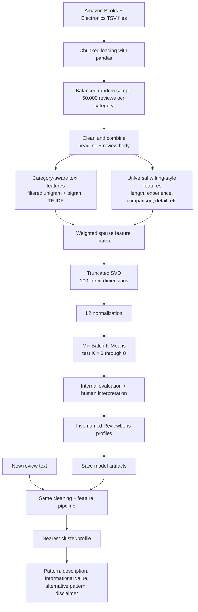

# ReviewLens

ReviewLens is an **unsupervised NLP prototype** for analyzing how a product review is written. Rather than predicting a ground-truth “useful / not useful” label, it discovers recurring review-writing patterns and assigns a new review to its closest learned pattern.

The system currently identifies five interpretable patterns:

| Pattern | Interpretation | Informational value |
| --- | --- | --- |
| Balanced Evaluative Review | Weighs positive and negative points. | Moderate to high |
| Extended Analytical Review | Gives a long, multi-sentence explanation or analysis. | High |
| Concise General Opinion | Gives brief praise, criticism, or rating-led opinion. | Low to moderate |
| Long-Term Usage Experience | Includes evidence from real use over time and specific performance details. | High |
| Personal Experience and Recommendation | Uses first-person experience and recommendation language. | Moderate |

> **Important:** ReviewLens returns the closest learned pattern. It does not claim that a review is objectively useful, truthful, or high quality, and it does not return a calibrated probability.

## Project objective

Product-review datasets usually do not provide a trustworthy label for “review usefulness.” Helpful-vote counts are incomplete and depend on factors beyond writing quality, including product popularity, review age, and visibility. ReviewLens therefore treats the task as **unsupervised pattern discovery**:

> Can NLP discover meaningful review-writing patterns without training on a hand-made usefulness label?

Human interpretation is applied only after clustering, when representative reviews and feature signals are inspected.

## End-to-end architecture



## Data

### Training sources

The prototype uses Amazon customer-review TSV files from two categories:

- Books: approximately 3.1 million source reviews
- Electronics: approximately 3.1 million source reviews

The first model was trained on a balanced, representative prototype corpus of **100,000 reviews**: 50,000 Books reviews and 50,000 Electronics reviews. The source files are scanned in chunks, so the full datasets are never loaded into memory at once. Raw TSV data is training material only and is intentionally excluded from this repository.

## Training pipeline

### 1. Cleaning and preparation

For each review, the headline and body are joined. The pipeline handles missing text, decodes HTML entities, removes HTML tags and URLs, normalizes whitespace, converts text to lowercase, and drops unusably short reviews (fewer than 15 characters).

Negation words such as `not`, `no`, and `never` are deliberately retained because removing them can reverse meaning—for example, turning “not good” into “good.”

### 2. Category-aware text features

Plain TF-IDF over a combined Books/Electronics dataset initially grouped reviews by product-domain terms such as “author,” “story,” “battery,” and “sound.” To reduce that effect, ReviewLens:

1. Builds candidate unigram and bigram vocabulary using `CountVectorizer`.
2. Computes document frequency separately for Books and Electronics.
3. Removes terms that occur in at least 0.2% of one category and at least five times more often in that category than the other.
4. Builds the final TF-IDF matrix from the remaining vocabulary.

For the prototype, 4,052 strongly category-specific terms were removed and 75,948 text features were retained.

### 3. Universal writing-style features

Text alone can still over-emphasize subject matter. ReviewLens therefore adds nine category-independent features:

- log word count
- sentence count
- vocabulary diversity
- numeric-detail rate
- first-person language rate
- long-term-use language rate
- comparison language rate
- contrast / pros-and-cons language rate
- exclamation count

The numeric style features are standardized with `StandardScaler`, L2-normalized, and weighted by `0.8` before being combined with the sparse TF-IDF matrix.

### 4. Dimensionality reduction

The combined sparse matrix is reduced with **Truncated SVD**:

- Components: `100`
- Iterations: `7`
- Random seed: `42`

SVD creates a compact latent representation suitable for clustering. The prototype retained **50.3% explained variance**, followed by L2 normalization.

### 5. Clustering

ReviewLens uses **MiniBatchKMeans**, which is more memory-efficient than ordinary K-Means for large review collections.

Candidate values from `K = 3` to `K = 8` were tested using silhouette score, Davies–Bouldin index, cluster-size balance, and representative-review inspection. The selected configuration uses **five clusters** with `batch_size=2048`, `n_init=10`, and `max_iter=200`.

## Evaluation

### Internal clustering metrics

| Metric | Prototype result | Interpretation |
| --- | ---: | --- |
| Selected clusters | 5 | Best practical balance of metric quality and interpretability |
| Silhouette score | 0.1785 | Positive separation in a noisy, high-variation text dataset |
| Davies–Bouldin index | 1.9654 | Reasonable between-cluster distinction; lower is better |
| Cluster-size range | ~14%–30% | No tiny or overwhelmingly dominant cluster |
| SVD explained variance | 50.3% | Useful structure retained after compression |

### Secondary helpful-vote validation

Helpful votes are **not** used as a model target, feature, or label. They are only examined after clustering as a secondary signal.

The results supported the human interpretations: the Extended Analytical cluster had the longest reviews and strongest average helpfulness ratios in both source categories, while the Concise General Opinion cluster had shorter reviews and lower ratios. This is correlation, not proof of objective usefulness.

### Why accuracy, precision, recall, and F1 are not reported

Those metrics require known correct labels. This dataset has no scientifically reliable ground-truth “usefulness” class, and the project deliberately avoids creating a false label from helpful votes. A future evaluation can use a separately collected, manually annotated holdout set, but the current prototype remains fully unsupervised.

## Inference architecture

After training, the raw dataset is no longer needed. The frontend/backend loads saved artifacts once, then every submitted review follows the same pipeline used for training:

```text
Review text
  -> cleaning
  -> filtered TF-IDF + writing-style features
  -> SVD + normalization
  -> distance to five cluster centres
  -> closest named profile
```

This processes one review rather than millions of rows, so it is suitable for responsive UI interaction.

## Repository structure

```text
ReviewLens/
├── models/                       # Saved model artifacts, copied from Google Drive
│   └── README.md
├── notebooks/
│   └── ReviewLens_Training.ipynb
├── src/
│   └── reviewlens_inference.py   # Reusable backend/frontend integration module
├── requirements.txt
└── README.md
```

## Saved model artifacts

Copy the files produced by the notebook from Google Drive into `models/` before using inference:

- `tfidf_vectorizer.joblib`
- `svd_model.joblib`
- `normalizer.joblib`
- `clustering_model.joblib`
- `style_scaler.joblib`
- `cluster_profiles.json`
- `model_metadata.json`

See [models/README.md](models/README.md) for details. Before committing a model artifact, check that it is below GitHub’s 100 MB file-size limit. If an artifact is larger, use a release or a separate download location.

## Setup and use

Install the dependencies:

```bash
pip install -r requirements.txt
```

Use the saved model from Python:

```python
from src.reviewlens_inference import ReviewLens

reviewlens = ReviewLens("models")
result = reviewlens.analyze(
    "I have used these headphones for six months. The battery lasts eight hours, "
    "but the earcups become uncomfortable after long use."
)
print(result)
```

The response contains the closest review pattern, its description, informational value, alternative pattern, distance, and disclaimer. The raw distance is an internal diagnostic and should not be displayed as an accuracy percentage or confidence score in the UI.

## Frontend handoff

The UI only needs a review text field and an **Analyze Review** action. It should display:

1. Closest learned pattern
2. Profile description
3. Informational value
4. Alternative pattern
5. The model disclaimer

The `ReviewLens` class in `src/reviewlens_inference.py` is the integration boundary for a web application or API. The frontend must not load raw TSV files or trigger model training.

## Limitations and future work

- The prototype is trained on Books and Electronics only; future versions can add categories through balanced chunked sampling and full retraining.
- Some clusters still have category skew. The model reduces topic dominance but does not claim to be perfectly category-neutral.
- The five profile names are human interpretations of unsupervised clusters.
- No supervised accuracy metric is claimed without an independently labelled evaluation dataset.
- A future version can add an API, user interface, a manually annotated evaluation set, model-version tracking, and retraining on a broader corpus.

## Technology stack

- Python
- Google Colab and Google Drive for training and artifact storage
- pandas and NumPy for chunked data processing
- scikit-learn for `CountVectorizer`, `TfidfVectorizer`, `StandardScaler`, `Normalizer`, `TruncatedSVD`, and `MiniBatchKMeans`
- SciPy sparse matrices for efficient feature combination
- joblib for model serialization

No deep-learning model is used in this prototype. The chosen classical NLP approach is computationally practical, explainable, and fast at inference time.
